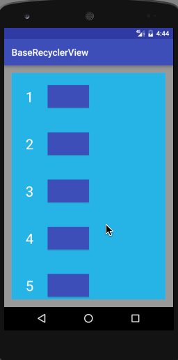

＃主要的功能：
1、下拉刷新；（参考：https://github.com/changjiashuai/PullToRefreshLayout;

2、上拉加载（参考：https://github.com/CymChad/BaseRecyclerViewAdapterHelper）；

3、滑动删除；

＃说明：
下拉刷新通过PullToRefreshLayout.OnRefreshListener，上拉加载通过BaseQuickAdapter.RequestLoadMoreListener，
滑动删除通过SwipeMenuCreator。
需要注意下，RecyclerView中的Adapter需要BaseQuickAdapter，DemoHolder继承DemoHolder；如果使用系统的Adapter
就不会有加载更多的功能；


#效果图


#使用步骤
##导入项目（Android Studio）
    allprojects {
		repositories {
			...
			maven { url "https://jitpack.io" }
		}
	}

	dependencies {
    	        compile 'com.github.ludeyuan:RefreshLoadRecyclerView:2.2'
    	}

##配置代码
1、xml
    ```
    <ldy.com.baserecyclerview.refresh.PullToRefreshLayout
        android:layout_width="match_parent"
        android:layout_height="wrap_content"
        android:background="@android:color/white"
        android:orientation="vertical">

        <ldy.com.baserecyclerview.recyclerview.SwipeMenuRecyclerView
            android:layout_width="match_parent"
            android:layout_height="wrap_content" />
    </ldy.com.baserecyclerview.refresh.PullToRefreshLayout>
    ```

2、设置下拉刷新
    mSwipeRefreshLayout.setOnRefreshListener(new PullToRefreshLayout.OnRefreshListener() {
        @Override
        public void onRefresh() {
            //执行刷新的事件，并在刷新完成后调用mSwipeRefreshLayout.endRefresh();
        });

3、设置上拉加载
    mAdapter.openLoadAnimation();
    mAdapter.setOnLoadMoreListener(new BaseQuickAdapter.RequestLoadMoreListener(){
        @Override
        public void onLoadMoreRequested() {
            //执行加载更多的操作

            ...

            //加载完成后调用下面的方法
            mAdapter.addData(lists);
            mAdapter.notifyDataChangedAfterLoadMore(true);
        }
    });
    mAdapter.openLoadMore(lists.size(),true);

4、设置滑动删除

    //设置滑动后出现的菜单
    mAdapter.setSwipeMenuCreator(new SwipeMenuCreator() {
        @Override
        public void onCreateMenu(SwipeMenu swipeLeftMenu, SwipeMenu swipeRightMenu, int viewType) {
        int width = getResources().getDimensionPixelSize(R.dimen.item_height);

         // MATCH_PARENT 自适应高度，保持和内容一样高；也可以指定菜单具体高度，也可以用WRAP_CONTENT。
         int height = ViewGroup.LayoutParams.MATCH_PARENT;

         // 添加右侧的，如果不添加，则右侧不会出现菜单。
         {
            SwipeMenuItem deleteItem = new SwipeMenuItem(MainActivity.this)
            .setBackgroundColor(Color.GRAY)
            .setText("取消收藏") // 文字，还可以设置文字颜色，大小等。。
            .setTextColor(Color.WHITE)
            .setWidth(width)
            .setHeight(height);
            swipeRightMenu.addMenuItem(deleteItem);// 添加一个按钮到右侧侧菜单。
         }
         //左侧不添加，就不会出现
    });

    //设置点击
    mAdapter.setSwipeMenuItemClickListener(new OnSwipeMenuItemClickListener() {
    /**
    * Item的菜单被点击的时候调用。
    * @param closeable       closeable. 用来关闭菜单。
    * @param adapterPosition adapterPosition. 这个菜单所在的item在Adapter中position。
    * @param menuPosition    menuPosition. 这个菜单的position。比如你为某个Item创建了2个MenuItem，那么这个position可能是是 0、1，
    * @param direction       如果是左侧菜单，值是：SwipeMenuRecyclerView#LEFT_DIRECTION，如果是右侧菜单，值是：SwipeMenuRecyclerView#RIGHT_DIRECTION.
    */

    @Override
    public void onItemClick(Closeable closeable, int adapterPosition, int menuPosition, int direction) {
        closeable.smoothCloseMenu();// 关闭被点击的菜单。

        if (direction == SwipeMenuRecyclerView.RIGHT_DIRECTION) {
            Toast.makeText(MainActivity.this, "list第" + adapterPosition + "; 右侧菜单第" + menuPosition, Toast.LENGTH_SHORT).show();

        } else if (direction == SwipeMenuRecyclerView.LEFT_DIRECTION) {
            Toast.makeText(MainActivity.this, "list第" + adapterPosition + "; 左侧菜单第" + menuPosition, Toast.LENGTH_SHORT).show();
        }

        // TODO 如果是删除：推荐调用Adapter.notifyItemRemoved(position)，不推荐Adapter.notifyDataSetChanged();
        if (menuPosition == 0) {// 删除按钮被点击。
            mLists.remove(adapterPosition);
            mAdapter.notifyItemRemoved(adapterPosition);
        }
    });
